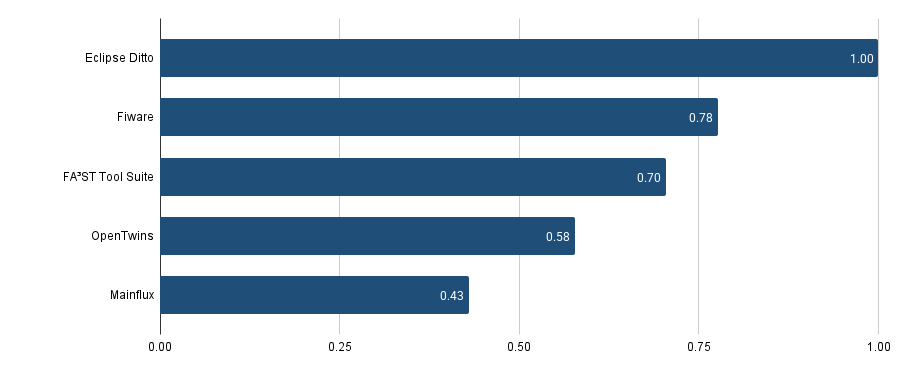

# Digital Twin Project

This repository contains the implementation of a **Digital Twin architecture** for a **Smart Classroom** scenario, developed as part of the final project in *Engenharia Informática – Instituto Politécnico de Bragança (IPB)*.

The project explores **open-source platforms** for Digital Twin development, applying **AHP–TOPSIS** as a multi-criteria decision-making methodology to select the most suitable platform. The final implementation uses **Eclipse Ditto** at its core, integrated with IoT simulators, data pipelines, dashboards, and AI components.

---

## 📌 Objectives
- Evaluate the **capabilities and limitations** of different open-source Digital Twin platforms.  
- Develop a **functional Digital Twin** of a Smart Classroom with virtual sensors and actuators.  
- Produce **documentation and implementation guides** for reproducibility and future projects.  

---

## 🏛️ Architecture

**Case Study: Smart Classroom**
- Virtual sensors: temperature, humidity, occupancy, energy.  
- Virtual actuators: window and lighting.  
- Pipeline:
  1. Wokwi/Unity → EMQX MQTT  
  2. EMQX MQTT → Eclipse Ditto  
  3. Eclipse Ditto → Telegraf / InfluxDB  
  4. Grafana / Node-RED / Unity / Ollama  

---

## ⚙️ Components Developed
- Firmware for **virtual sensors** (Wokwi ESP32).  
- **JavaScript mappings** for Eclipse Ditto.  
- Dashboards in **Grafana** with InfluxDB as backend.  
- **Node-RED flows** integrating AI with LLM (Ollama).  
- **Unity 3D visualization** of the Smart Classroom.  

---

## 🚀 Functionalities Implemented
- Real-time monitoring of sensor data.  
- Historical visualization with **InfluxDB + Grafana**.  
- Automated control of actuators.  
- Natural language analysis via **Ollama LLM**.  
- Guided and reproducible demonstration pipeline.  

---

## 📊 Methodology
- **Evaluation Criteria:** compatibility, ease of implementation, documentation, community, scalability.  
- **AHP:** criteria weighting and hierarchy.  
- **TOPSIS:** ranking of alternatives.  
- **Result:** Eclipse Ditto selected as best open-source platform.  

---

## ✅ Results
- Reliable communication pipeline (MQTT → Ditto → InfluxDB).  
- Real-time dashboards in Grafana.  
- Successful automation of actuators.  
- Experimental integration of AI for natural language queries.  

---

## 🔍 Discussion
**Strengths:**  
- Modularity and interoperability.  
- Cost-effectiveness (open-source stack).  
- Reproducibility of implementation.  

**Limitations:**  
- Security not fully addressed.  
- Limited maturity of 3D visualization.  
- Scalability tests for industrial scenarios still pending.
